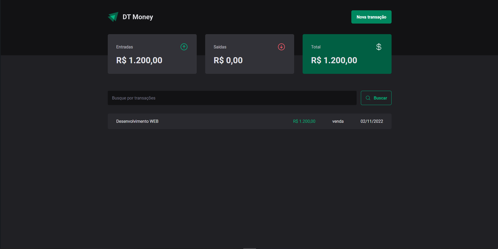
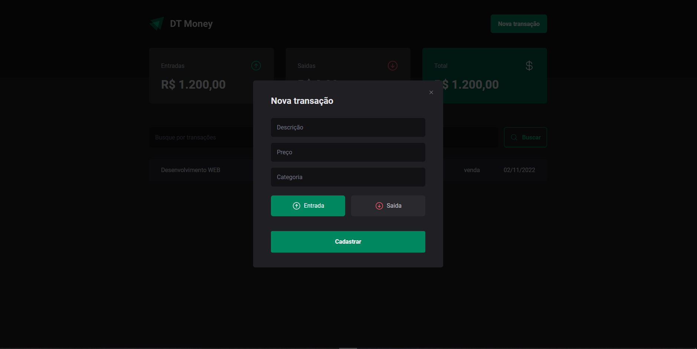
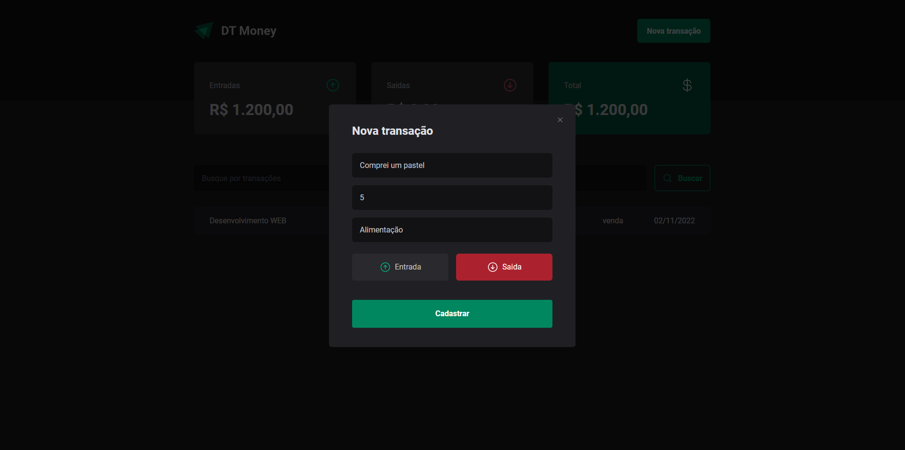
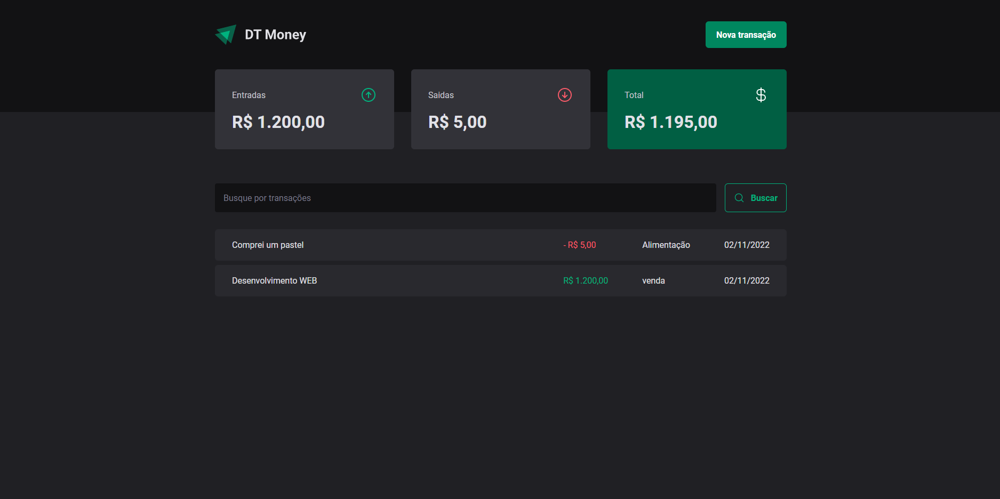

## DTMoney

Esta aplicação é uma aplicação desenvolvida no curso de programação da RocketSeat. Nela temos um Summary de transações.

This application is an application developed in the RocketSeat programming course. In it we have a Summary of transactions.

É possivel cadastrara uma nova transação clicando no botão "Nova transação".

It is possible to register a new transaction by clicking on the "Nova Transação" button.

Quando clicado um modal irá aparecer junto com um formulario, após a informações do formulario serem preechidas é necessário clicar no botão "Cadastrar"

When clicked, a modal will appear along with a form, after the form information is filled in, it is necessary to click on the "Cadastrar" button.

Quando cadastrar, as informações serão enviadas para o backend do json-server e a lista sera atualizada.

When registering, the information will be sent to the json-server backend and the list will be updated.

No terminal use o comando "npm run dev" e "npm run dev:server"

In the terminal use the command "npm run dev" and "npm run dev:server"

